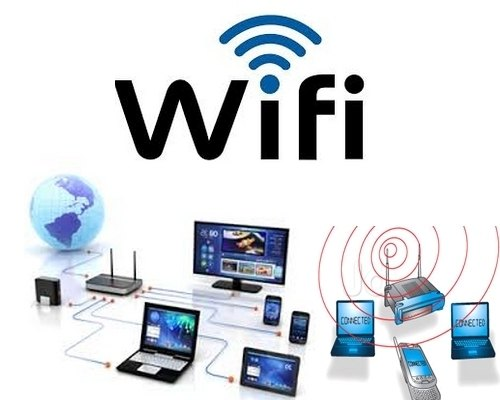

# Web-development
Oasis Infobyte Level 1 Task 1
<html>
<head>
    <title>Landing Page</title>
    
</head>
<body>
    

        <h1>Broadband services</h1>
        
Let's make more connection.Ultra fast internet!

    

    

        <h2>Our Services</h2>
        

            
            <h3>Services</h3>
            
We provide you ultra fast internet at low prices.
            Speed upto 100 mbps.
            

            
Price  199 per month

        

    

        <h2>About Us</h2>
        
Broadband services is an US based company which have branches
            all over the world.The moto of our company 
            is to provide fast internet services to the users.
            
            
        <a href="#" class="cta-button">Learn More</a>
    

    

        <h2>Our Services</h2>
        
 We provide users a fast internet connection upto 100mbps
        at low prices which is 199 per month only.
     

    

        <h2>Contact Us</h2>
        
Have questions? Contact us at Broadbandservices21@gmail.com or call us at 9341576810.

    

</body>
</html>

